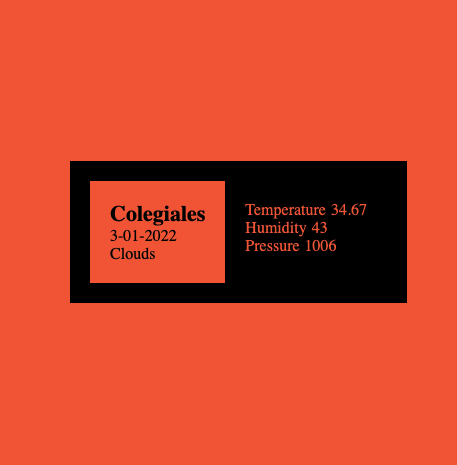

# api_weather
app que utiliza la geolocalización del usuario y presenta información sobre el clima del lugar.

App desarrollada en este tutorial: https://youtu.be/yT_wBSQ9EIs

Tecnologías:

HTML
Css
JavaScript
